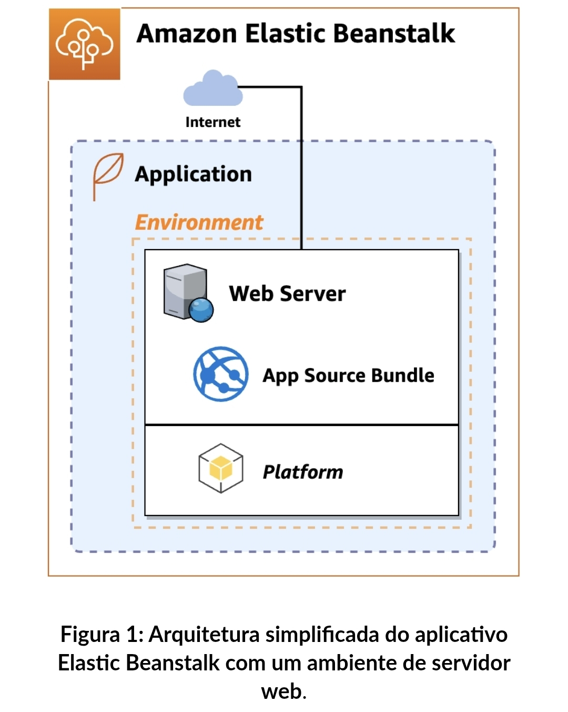

# AWS Elastic Beanstalk Lab

## Overview
This project demonstrates application deployment and infrastructure management using AWS Elastic Beanstalk.

## Architecture

The following diagram illustrates the simplified architecture of the AWS Elastic Beanstalk environment used in this hands-on laboratory.

*Figure 1. Simplified architecture of the AWS Elastic Beanstalk environment.*

## Objectives
- Create IAM roles
- Deploy a sample Node.js application
- Monitor application health
- Explore CloudFormation resources
- Perform application deployment updates
- Analyze logs and metrics

## Technologies
- AWS Elastic Beanstalk
- Amazon EC2
- AWS CloudFormation
- Amazon CloudWatch
- IAM
- Node.js

## Skills Demonstrated
- Platform as a Service (PaaS)
- Application deployment
- Infrastructure automation
- Monitoring and logging
- IAM configuration
- Managed cloud services

## Repository Structure
/docs
/screenshots
README.md

## Author
Diego Henrique de Araújo
Electrical and Electronic Engineer | Cloud Computing | AWS
